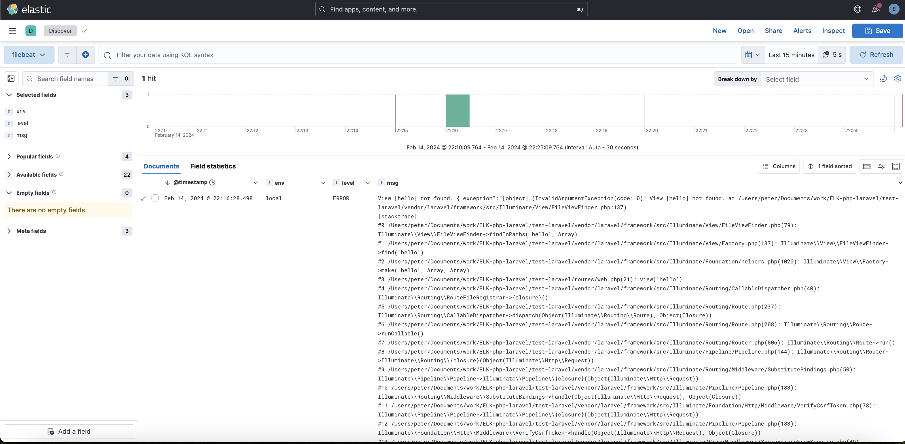

# ELK-PHP-LARAVEL

## 目錄

1. 說明
1. 架構說明
1. ELK 安裝方式
1. 使用方式

### 說明

這是一個為了練習 ELK 架設，以及 練習將 php laravel 透過 logstash 拆分的一個專案。

|  元件 | 說明 | 訪問 url | 帳號密碼 |
| ---- | ---- | --- | --- |
| es01 | 資料庫-1 | x | elk/.env |
| es02 | 資料庫-2 | x | elk/.env |
| es03 | 資料庫-3 | x | elk/.env |
| kibana | 圖形化介面 | 127.0.0.1:5601 | elk/.env |
| filebeat | 採集 log的元件 | x | x |
| logstash | log 處理的元件 | x | x |

### 架構說明

```txt
Readme.md       # readme  
elk             # elk 本體，使用 docker 架設
test-laravel    # test-laravel，使用 laravel new 的測試專案，主要用來產生 laravel log 
```

### 安裝方式

#### ELK 本體

```txt
cd elk 
docker compose up -d 
```

docker 起來會有六個容器
docker compose 有一個 setup 容器，就是 setup 而已，會自動消失

```txt
docker compose ps 
NAME             IMAGE                                                  COMMAND                   SERVICE    CREATED         STATUS                   PORTS
elk-es01-1       docker.elastic.co/elasticsearch/elasticsearch:8.12.1   "/bin/tini -- /usr/l…"   es01       4 minutes ago   Up 4 minutes (healthy)   0.0.0.0:9200->9200/tcp, 9300/tcp
elk-es02-1       docker.elastic.co/elasticsearch/elasticsearch:8.12.1   "/bin/tini -- /usr/l…"   es02       4 minutes ago   Up 4 minutes (healthy)   9200/tcp, 9300/tcp
elk-es03-1       docker.elastic.co/elasticsearch/elasticsearch:8.12.1   "/bin/tini -- /usr/l…"   es03       4 minutes ago   Up 4 minutes (healthy)   9200/tcp, 9300/tcp
elk-filebeat-1   docker.elastic.co/beats/filebeat:8.12.1                "/usr/bin/tini -- /u…"   filebeat   4 minutes ago   Up 4 minutes
elk-kibana-1     docker.elastic.co/kibana/kibana:8.12.1                 "/bin/tini -- /usr/l…"   kibana     4 minutes ago   Up 4 minutes (healthy)   0.0.0.0:5601->5601/tcp
elk-logstash-1   docker.elastic.co/logstash/logstash:8.12.1             "/usr/local/bin/dock…"   logstash   4 minutes ago   Up 4 minutes             5044/tcp, 9600/tcp
```

docker volume，類似硬碟的東西。
如果覺得很醜之後要刪除可以用 docker volume rm ${名稱}

```txt
docker volume ls 
DRIVER    VOLUME NAME
local     elk_certs
local     elk_esdata01
local     elk_esdata02
local     elk_esdata03
local     elk_kibanadata
```

#### PHP 

```txt
php --version
PHP 8.3.2 (cli) (built: Jan 16 2024 13:46:41) (NTS)
Copyright (c) The PHP Group
Zend Engine v4.3.2, Copyright (c) Zend Technologies
    with Zend OPcache v8.3.2, Copyright (c), by Zend Technologies

compsoer --version
Composer version 2.6.6 2023-12-08 18:32:26

composer create-project laravel/laravel test-laravel
```

然後修改

```txt
routes/web.php 

Route::get('/hello', function () {
    return view('hello');
});
```

這樣使用 php artisan serve，就可以用 `curl 127.0.0.1:8000/hello` 產生 laravel.log 了。

### 使用方式

由於這有點麻煩，就暫時富奸吧。

成果圖
